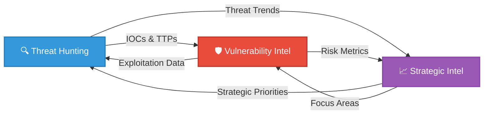
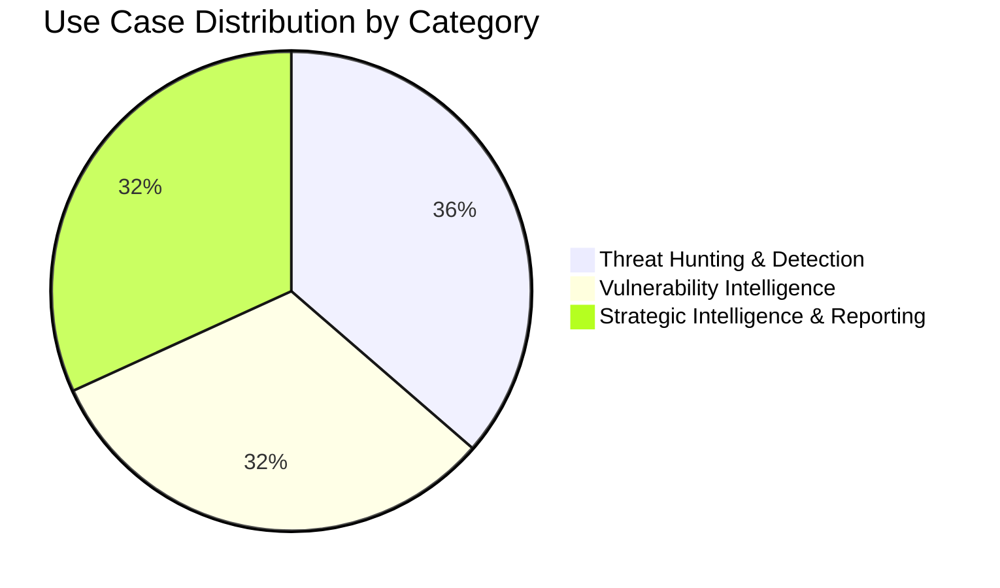

# 📊 Category Overview

A visual overview of all three CTI use case categories with their characteristics, use case counts, and key capabilities.

```mermaid
graph TB
    subgraph Legend[" "]
        L1[🎯 CTI Use Case Library<br/>22 Total Use Cases Across 3 Categories]
    end

    subgraph Category1[" 🔍 THREAT HUNTING & DETECTION "]
        TH_Title[<b>Threat Hunting & Detection</b><br/>8 Use Cases]

        TH_Desc[Proactive threat identification<br/>and detection engineering]

        TH_UC1[UC001: Ransomware Hash Pivoting]
        TH_UC2[UC002: APT Infrastructure Tracking]
        TH_UC3[UC003: Living Off Land Detection]
        TH_UC4[UC004: C2 Beaconing Patterns]
        TH_UC5[UC005: Phishing Domain Patterns]
        TH_UC6[UC006: Credential Stuffing Detection]
        TH_UC7[UC007: CVE Exploitation Hunt]
        TH_UC8[UC008: Malware Distribution Tracking]

        TH_Title --> TH_Desc
        TH_Desc --> TH_UC1
        TH_Desc --> TH_UC2
        TH_Desc --> TH_UC3
        TH_Desc --> TH_UC4
        TH_Desc --> TH_UC5
        TH_Desc --> TH_UC6
        TH_Desc --> TH_UC7
        TH_Desc --> TH_UC8

        TH_Tools[Key Tools:<br/>🔎 TIP<br/>📊 SIEM<br/>🛡️ EDR/XDR<br/>🕵️ Hunting Platform]

        TH_UC8 --> TH_Tools
    end

    subgraph Category2[" 🛡️ VULNERABILITY INTELLIGENCE "]
        VI_Title[<b>Vulnerability Intelligence</b><br/>7 Use Cases]

        VI_Desc[Threat-informed vulnerability<br/>management & prioritization]

        VI_UC1[UC001: CVE Exploit Prioritization]
        VI_UC2[UC002: Zero-Day Tracking]
        VI_UC3[UC003: Vulnerability-TTP Mapping]
        VI_UC4[UC004: Exploit Code Monitoring]
        VI_UC5[UC005: Asset-Vulnerability Correlation]
        VI_UC6[UC006: Exploit Kit Tracking]
        VI_UC7[UC007: Threat-Informed Patching]

        VI_Title --> VI_Desc
        VI_Desc --> VI_UC1
        VI_Desc --> VI_UC2
        VI_Desc --> VI_UC3
        VI_Desc --> VI_UC4
        VI_Desc --> VI_UC5
        VI_Desc --> VI_UC6
        VI_Desc --> VI_UC7

        VI_Tools[Key Tools:<br/>🛡️ Vuln Scanner<br/>🔎 TIP<br/>📦 Asset Mgmt<br/>🔧 Patch Mgmt]

        VI_UC7 --> VI_Tools
    end

    subgraph Category3[" 📈 STRATEGIC INTELLIGENCE & REPORTING "]
        SI_Title[<b>Strategic Intelligence & Reporting</b><br/>7 Use Cases]

        SI_Desc[Executive intelligence<br/>and strategic analysis]

        SI_UC1[UC001: Quarterly Threat Briefing]
        SI_UC2[UC002: Industry Threat Analysis]
        SI_UC3[UC003: Threat Actor Evolution]
        SI_UC4[UC004: Geopolitical Impact Assessment]
        SI_UC5[UC005: Compliance Threat Reporting]
        SI_UC6[UC006: Threat Forecasting]
        SI_UC7[UC007: Annual Retrospective]

        SI_Title --> SI_Desc
        SI_Desc --> SI_UC1
        SI_Desc --> SI_UC2
        SI_Desc --> SI_UC3
        SI_Desc --> SI_UC4
        SI_Desc --> SI_UC5
        SI_Desc --> SI_UC6
        SI_Desc --> SI_UC7

        SI_Tools[Key Tools:<br/>🔎 TIP<br/>📊 Analytics Platform<br/>📈 Reporting Tool<br/>🌐 Threat Feeds]

        SI_UC7 --> SI_Tools
    end

    style L1 fill:#2c3e50,stroke:#34495e,stroke-width:3px,color:#fff
    style Category1 fill:#e8f4f8,stroke:#3498db,stroke-width:3px
    style Category2 fill:#fef5f5,stroke:#e74c3c,stroke-width:3px
    style Category3 fill:#f4f0f9,stroke:#9b59b6,stroke-width:3px
    style TH_Title fill:#3498db,stroke:#2980b9,stroke-width:2px,color:#fff
    style VI_Title fill:#e74c3c,stroke:#c0392b,stroke-width:2px,color:#fff
    style SI_Title fill:#9b59b6,stroke:#8e44ad,stroke-width:2px,color:#fff
    style TH_Tools fill:#5dade2,stroke:#3498db,stroke-width:2px,color:#fff
    style VI_Tools fill:#ec7063,stroke:#e74c3c,stroke-width:2px,color:#fff
    style SI_Tools fill:#af7ac5,stroke:#9b59b6,stroke-width:2px,color:#fff
```

## 📋 Category Comparison Matrix

| Aspect | 🔍 Threat Hunting | 🛡️ Vulnerability Intel | 📈 Strategic Intel |
|--------|------------------|------------------------|-------------------|
| **Use Cases** | 8 | 7 | 7 |
| **Focus** | Tactical Detection | Risk Management | Strategic Planning |
| **Audience** | SOC Analysts, Hunters | Vulnerability Mgmt, SecOps | Executives, Leadership |
| **Timeframe** | Real-time to Daily | Weekly to Monthly | Monthly to Quarterly |
| **Output** | Detections, IOCs, Investigations | Prioritized Vuln Lists, Patch Plans | Reports, Briefings, Forecasts |
| **Automation** | High (SIEM rules, alerts) | Medium (scanning, tracking) | Low (analysis-heavy) |
| **Technical Depth** | High | Medium-High | Medium |

## 🎯 Category Deep Dive

### 🔍 Threat Hunting & Detection (8 Use Cases)

**Purpose:** Proactively identify threats and build detection capabilities

**Key Characteristics:**
- ⚡ Real-time or near-real-time operations
- 🔍 Hypothesis-driven investigations
- 🎯 IOC-based hunting and pivoting
- 🚨 Detection rule development
- 🕵️ Incident response support

**Common Workflows:**
1. Receive threat intelligence (IOCs, TTPs)
2. Hunt for indicators in environment
3. Investigate findings and pivot on discoveries
4. Validate threats and assess impact
5. Create detections for ongoing monitoring

**Success Metrics:**
- Time to detect threats
- Coverage of MITRE ATT&CK techniques
- Detection rule quality/fidelity
- Threat hunting effectiveness

---

### 🛡️ Vulnerability Intelligence (7 Use Cases)

**Purpose:** Prioritize and manage vulnerabilities using threat intelligence

**Key Characteristics:**
- 📊 Risk-based prioritization
- 🎭 Threat actor context
- ⚡ Exploit activity tracking
- 🔗 Asset correlation
- ⏱️ Timeline analysis (disclosure → exploitation)

**Common Workflows:**
1. Identify vulnerabilities in environment
2. Enrich with threat intelligence
3. Assess exploitation likelihood
4. Prioritize based on risk
5. Track remediation progress

**Success Metrics:**
- Mean time to patch critical vulns
- Reduction in exploitable exposure
- Patch prioritization accuracy
- Prevented exploitation attempts

---

### 📈 Strategic Intelligence & Reporting (7 Use Cases)

**Purpose:** Inform strategic decisions and leadership awareness

**Key Characteristics:**
- 👔 Executive-friendly format
- 🏢 Industry/sector focus
- 🌍 Geopolitical context
- 📅 Trend analysis
- 💼 Business risk alignment

**Common Workflows:**
1. Collect intelligence from multiple sources
2. Analyze trends and patterns
3. Contextualize for organization
4. Create executive summaries
5. Present findings to leadership

**Success Metrics:**
- Leadership engagement
- Security investment decisions informed
- Risk awareness improvement
- Strategic alignment

## 🔄 Category Interdependencies

### How Categories Work Together:

**Tactical to Strategic Flow:**
- 🔍 Hunting discovers threats → 📈 Strategic reports on threat landscape
- 🛡️ Vulnerability trends → 📈 Risk reporting to leadership

**Strategic to Tactical Flow:**
- 📈 Strategic priorities → 🔍 Focused hunting campaigns
- 📈 Executive concerns → 🛡️ Vulnerability focus areas

**Lateral Integration:**
- 🔍 Discovered exploits → 🛡️ Vulnerability prioritization
- 🛡️ Zero-day intel → 🔍 Proactive hunting

## 📊 Use Case Distribution

**Total: 22 Use Cases**

## 🎓 Skill Level Requirements

| Category | Entry Level | Intermediate | Advanced |
|----------|------------|--------------|----------|
| **🔍 Threat Hunting** | UC005, UC006 | UC001, UC003, UC007 | UC002, UC004, UC008 |
| **🛡️ Vulnerability Intel** | UC001, UC004 | UC003, UC005, UC007 | UC002, UC006 |
| **📈 Strategic Intel** | UC002, UC005 | UC001, UC006, UC007 | UC003, UC004 |

**Recommendation:** Start with entry-level use cases in each category to build foundational skills before advancing to more complex scenarios.

## 🛠️ Tool Investment Guidance

### Minimum Viable Toolset by Category

**🔍 Threat Hunting & Detection:**
- Essential: TIP, SIEM, EDR
- Nice-to-Have: Sandbox, NSM, SOAR

**🛡️ Vulnerability Intelligence:**
- Essential: Vulnerability Scanner, TIP
- Nice-to-Have: Asset Management, Patch Management

**📈 Strategic Intelligence:**
- Essential: TIP, Analytics/Reporting Tool
- Nice-to-Have: Threat Feeds, Visualization Platform

### Budget Allocation Suggestion
- 🔍 Threat Hunting: 40% (highest tool complexity)
- 🛡️ Vulnerability Intel: 35% (scanner + integration)
- 📈 Strategic Intel: 25% (mostly analysis, less tooling)

---

**💡 Remember:** These categories are complementary! A mature CTI program leverages use cases across all three categories to provide comprehensive threat intelligence capabilities.
