# 🗺️ Product Mapping Flow

This diagram illustrates how to select the right CTI products and tools for your use case using the Product Mapping Guide and CTI Product Assessment Matrix.

```mermaid
graph TB
    Start([📋 Start: Have a Use Case]) --> ReadUC[📖 Read Use Case]

    ReadUC --> Inputs[📥 Identify Required Inputs]

    Inputs --> InputTypes{📊 Input Types}

    InputTypes --> IT1[🔍 Threat Intelligence Feeds]
    InputTypes --> IT2[🌐 Network Telemetry]
    InputTypes --> IT3[📁 File/Malware Analysis]
    InputTypes --> IT4[🛡️ Vulnerability Data]
    InputTypes --> IT5[📧 Email/Phishing Data]
    InputTypes --> IT6[☁️ Cloud/SaaS Logs]

    IT1 --> Capabilities
    IT2 --> Capabilities
    IT3 --> Capabilities
    IT4 --> Capabilities
    IT5 --> Capabilities
    IT6 --> Capabilities

    Capabilities[🎯 Map to Required Capabilities]

    Capabilities --> CapList{🔧 Capabilities Needed}

    CapList --> C1[🔎 Threat Intelligence Platform]
    CapList --> C2[📊 SIEM/Log Analytics]
    CapList --> C3[🕵️ Threat Hunting Platform]
    CapList --> C4[🔬 Sandbox/Malware Analysis]
    CapList --> C5[🌐 Network Security Monitoring]
    CapList --> C6[🛡️ Vulnerability Management]
    CapList --> C7[📈 Reporting/Visualization]

    C1 --> Guide
    C2 --> Guide
    C3 --> Guide
    C4 --> Guide
    C5 --> Guide
    C6 --> Guide
    C7 --> Guide

    Guide[📚 Consult Product<br/>Mapping Guide]

    Guide --> Category{📂 Use Case Category}

    Category -->|Threat Hunting| Hunt[🔍 Threat Hunting<br/>Capabilities]
    Category -->|Vulnerability| Vuln[🛡️ Vulnerability Intel<br/>Capabilities]
    Category -->|Strategic| Strat[📈 Strategic Intel<br/>Capabilities]

    Hunt --> HuntCap[Required Products:<br/>- TIP<br/>- SIEM<br/>- EDR/XDR<br/>- Threat Hunting Tool]
    Vuln --> VulnCap[Required Products:<br/>- Vuln Scanner<br/>- TIP<br/>- SIEM<br/>- Asset Management]
    Strat --> StratCap[Required Products:<br/>- TIP<br/>- Reporting Tool<br/>- Threat Intel Feeds<br/>- Analytics Platform]

    HuntCap --> Matrix
    VulnCap --> Matrix
    StratCap --> Matrix

    Matrix[🔗 Reference CTI Product<br/>Assessment Matrix]

    Matrix --> Evaluate{⚖️ Evaluate Products}

    Evaluate --> Criteria[📋 Assessment Criteria]

    Criteria --> CR1[✅ Data Collection]
    Criteria --> CR2[🔄 Processing & Enrichment]
    Criteria --> CR3[🔍 Analysis & Hunting]
    Criteria --> CR4[🤖 Detection & Response]
    Criteria --> CR5[📊 Reporting & Dissemination]
    Criteria --> CR6[🔗 Integration & APIs]
    Criteria --> CR7[⚡ Automation]

    CR1 --> Compare
    CR2 --> Compare
    CR3 --> Compare
    CR4 --> Compare
    CR5 --> Compare
    CR6 --> Compare
    CR7 --> Compare

    Compare[📊 Compare Products]

    Compare --> Current{🏢 Current Tools?}

    Current -->|Yes| Gap[🔍 Gap Analysis]
    Current -->|No| Select

    Gap --> GapResults{📊 Gap Results}

    GapResults -->|Sufficient| Configure[⚙️ Configure Existing Tools]
    GapResults -->|Gaps Found| Select

    Select[🎯 Select New Products]

    Select --> Vendor[📧 Vendor Evaluation]

    Vendor --> V1[💼 Commercial TIP]
    Vendor --> V2[🆓 Open Source Tools]
    Vendor --> V3[☁️ Cloud-Native Solutions]
    Vendor --> V4[🔧 Custom Build]

    V1 --> POC
    V2 --> POC
    V3 --> POC
    V4 --> POC

    Configure --> Implement

    POC[🧪 Proof of Concept]

    POC --> TestUC[✅ Test with Use Case]

    TestUC --> Results{📈 Results}

    Results -->|Success| Implement[🚀 Implement Solution]
    Results -->|Failure| Iterate[🔄 Iterate Selection]

    Iterate --> Compare

    Implement --> Integrate[🔗 Integration]

    Integrate --> I1[📊 Data Sources]
    Integrate --> I2[🔄 Workflows]
    Integrate --> I3[🤖 Automation]
    Integrate --> I4[📈 Dashboards]

    I1 --> Validate
    I2 --> Validate
    I3 --> Validate
    I4 --> Validate

    Validate[✓ Validate Against<br/>Acceptance Criteria]

    Validate --> Success{✅ Meets Criteria?}

    Success -->|Yes| Done([✓ Ready for Production])
    Success -->|No| Tune[🔧 Tune Configuration]

    Tune --> Validate

    style Start fill:#2c3e50,stroke:#34495e,stroke-width:3px,color:#fff
    style Hunt fill:#3498db,stroke:#2980b9,stroke-width:2px,color:#fff
    style Vuln fill:#e74c3c,stroke:#c0392b,stroke-width:2px,color:#fff
    style Strat fill:#9b59b6,stroke:#8e44ad,stroke-width:2px,color:#fff
    style Matrix fill:#f39c12,stroke:#d68910,stroke-width:3px,color:#fff
    style Done fill:#27ae60,stroke:#229954,stroke-width:3px,color:#fff
    style POC fill:#e67e22,stroke:#d35400,stroke-width:2px,color:#fff
```

## 🎯 Product Selection Process

### Step 1: Use Case Analysis
Start by thoroughly understanding your use case:
- Required inputs and data sources
- Expected outputs and deliverables
- Workflow complexity
- Acceptance criteria

### Step 2: Capability Mapping
Map use case requirements to product capabilities:

| Category | Primary Products | Secondary Products |
|----------|-----------------|-------------------|
| **🔍 Threat Hunting** | TIP, SIEM, EDR/XDR | Sandbox, NSM, SOAR |
| **🛡️ Vulnerability Intel** | Vuln Scanner, TIP, Asset Mgmt | SIEM, CMDB, Patch Mgmt |
| **📈 Strategic Intel** | TIP, Analytics, Reporting | Threat Feeds, Viz Tools |

### Step 3: Product Assessment
Use the **CTI Product Assessment Matrix** to evaluate products across:

#### Core Assessment Dimensions
1. **📥 Data Collection**
   - Threat feed integration
   - Data source variety
   - Collection automation

2. **🔄 Processing & Enrichment**
   - IOC enrichment
   - Context addition
   - Data normalization

3. **🔍 Analysis & Hunting**
   - Query capabilities
   - Pivot/correlation features
   - Investigation workflows

4. **🤖 Detection & Response**
   - Rule creation
   - Alert generation
   - Response automation

5. **📊 Reporting & Dissemination**
   - Report templates
   - Customization options
   - Distribution methods

6. **🔗 Integration & APIs**
   - API availability
   - Integration options
   - Data format support

7. **⚡ Automation**
   - Workflow automation
   - Playbook support
   - Orchestration capabilities

### Step 4: Gap Analysis
If you have existing tools:
- ✅ Identify what's already covered
- 🔍 Find capability gaps
- ⚖️ Decide: configure existing tools vs. acquire new ones

### Step 5: Vendor Evaluation
Consider different deployment models:

```mermaid
graph LR
    A[Product Options] --> B[💼 Commercial TIP]
    A --> C[🆓 Open Source]
    A --> D[☁️ Cloud SaaS]
    A --> E[🔧 Custom Build]

    B --> B1[Vendor Support]
    B --> B2[Feature Rich]
    B --> B3[Higher Cost]

    C --> C1[Low/No Cost]
    C --> C2[Flexibility]
    C --> C3[DIY Support]

    D --> D1[Quick Deploy]
    D --> D2[Scalable]
    D --> D3[Subscription]

    E --> E1[Full Control]
    E --> E2[High Investment]
    E --> E3[Maintenance]

    style A fill:#2c3e50,stroke:#34495e,stroke-width:2px,color:#fff
    style B fill:#3498db,stroke:#2980b9,stroke-width:2px,color:#fff
    style C fill:#27ae60,stroke:#229954,stroke-width:2px,color:#fff
    style D fill:#9b59b6,stroke:#8e44ad,stroke-width:2px,color:#fff
    style E fill:#e74c3c,stroke:#c0392b,stroke-width:2px,color:#fff
```

### Step 6: Proof of Concept
Always validate with your actual use case:
- ✅ Test workflow execution
- 📊 Verify output quality
- ⚡ Check performance
- 🔗 Validate integrations

### Step 7: Implementation & Validation
- 🔗 Integrate with existing systems
- 🤖 Automate workflows
- ✓ Validate against acceptance criteria
- 📈 Create dashboards and reports

## 🔗 Key Resources

1. **Product Mapping Guide** - `/docs/PRODUCT_MAPPING_GUIDE.md`
   - Maps use cases to product categories
   - Provides product selection guidance

2. **CTI Product Assessment Matrix** - External Repository
   - Comprehensive product evaluation framework
   - Detailed capability comparisons

3. **Use Case Templates** - `/templates/use-case-template.md`
   - Standard format for all use cases
   - Includes product requirement sections

## ⚠️ Common Pitfalls

| Pitfall | ❌ Avoid | ✅ Instead |
|---------|---------|-----------|
| **Tool-First Approach** | "We have this tool, what can we do?" | "What do we need to do? What tool fits best?" |
| **Over-Engineering** | Buying enterprise tools for simple use cases | Start simple, scale as needed |
| **Ignoring Integration** | Selecting products in isolation | Ensure ecosystem compatibility |
| **Skipping POC** | Trusting vendor demos only | Always test with real use cases |

---

**💡 Pro Tip:** The best CTI tool is the one your team will actually use. Consider usability, training requirements, and workflow fit alongside technical capabilities.
