# 📁 Repository Structure Diagram

This diagram visualizes the complete structure of the CTI Use Case Library repository.

```mermaid
graph TD
    A[🎯 CTI Use Case Library] --> B[📄 README.md]
    A --> C[📋 templates/]
    A --> D[🔍 threat-hunting-detection/]
    A --> E[🛡️ vulnerability-intelligence/]
    A --> F[📈 strategic-intelligence-reporting/]
    A --> G[📚 docs/]
    A --> H[🤝 CONTRIBUTING.md]
    A --> I[⚙️ .github/]

    C --> C1[📝 use-case-template.md]

    D --> D1[UC001: Ransomware File Hash Pivoting]
    D --> D2[UC002: APT Infrastructure Tracking]
    D --> D3[UC003: Living Off Land Detection]
    D --> D4[UC004: C2 Beaconing Pattern Hunt]
    D --> D5[UC005: Phishing Domain Patterns]
    D --> D6[UC006: Credential Stuffing Detection]
    D --> D7[UC007: CVE Exploitation Hunt]
    D --> D8[UC008: Malware Distribution Tracking]

    E --> E1[UC001: CVE Prioritization]
    E --> E2[UC002: Zero-Day Tracking]
    E --> E3[UC003: Vulnerability-TTP Mapping]
    E --> E4[UC004: Exploit Code Monitoring]
    E --> E5[UC005: Asset-Vulnerability Correlation]
    E --> E6[UC006: Exploit Kit Tracking]
    E --> E7[UC007: Threat-Informed Patching]

    F --> F1[UC001: Quarterly Threat Briefing]
    F --> F2[UC002: Industry Threat Analysis]
    F --> F3[UC003: Threat Actor Evolution]
    F --> F4[UC004: Geopolitical Impact Assessment]
    F --> F5[UC005: Compliance Threat Reporting]
    F --> F6[UC006: Threat Forecasting]
    F --> F7[UC007: Annual Retrospective]

    G --> G1[📊 diagrams/]
    G --> G2[📖 USAGE.md]
    G --> G3[🗺️ PRODUCT_MAPPING_GUIDE.md]
    G --> G4[🏅 badges.md]
    G --> G5[📋 plans/]

    G1 --> G1A[repository-structure.md]
    G1 --> G1B[workflow-overview.md]
    G1 --> G1C[product-mapping-flow.md]
    G1 --> G1D[category-overview.md]

    I --> I1[PULL_REQUEST_TEMPLATE.md]
    I --> I2[📋 ISSUE_TEMPLATE/]

    I2 --> I2A[new-use-case.md]
    I2 --> I2B[improve-use-case.md]

    style A fill:#2c3e50,stroke:#34495e,stroke-width:3px,color:#fff
    style D fill:#3498db,stroke:#2980b9,stroke-width:2px,color:#fff
    style E fill:#e74c3c,stroke:#c0392b,stroke-width:2px,color:#fff
    style F fill:#9b59b6,stroke:#8e44ad,stroke-width:2px,color:#fff
    style G fill:#27ae60,stroke:#229954,stroke-width:2px,color:#fff
    style C fill:#f39c12,stroke:#d68910,stroke-width:2px,color:#fff
```

## 📊 Structure Overview

### Core Directories

| Directory | Icon | Purpose | File Count |
|-----------|------|---------|------------|
| **threat-hunting-detection/** | 🔍 | Proactive threat hunting use cases | 8 |
| **vulnerability-intelligence/** | 🛡️ | Vulnerability management use cases | 7 |
| **strategic-intelligence-reporting/** | 📈 | Strategic intelligence use cases | 7 |
| **templates/** | 📋 | Use case templates for contributors | 1 |
| **docs/** | 📚 | Additional documentation & guides | 7+ |

### Documentation Structure

The `docs/` directory contains:
- 📊 **diagrams/** - Visual representations of workflows and structures
- 📖 **USAGE.md** - Comprehensive usage guide
- 🗺️ **PRODUCT_MAPPING_GUIDE.md** - CTI product mapping guide
- 🏅 **badges.md** - Repository badges and status indicators
- 📋 **plans/** - Implementation plans and design documents

### GitHub Integration

The `.github/` directory provides:
- 📝 Pull request templates
- 🐛 Issue templates for new use cases
- 💡 Issue templates for improvements

---

**📌 Note:** This structure is designed to be intuitive for CTI practitioners while maintaining clear separation between use case categories and supporting documentation.
