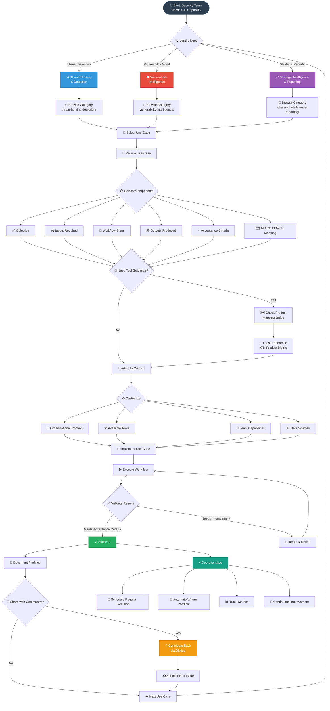

# 🔄 Workflow Overview

This diagram shows the end-to-end workflow for using the CTI Use Case Library, from discovery to implementation.

## 🎯 Workflow Phases

### Phase 1: Discovery & Selection
1. **Identify Need** - Determine which CTI capability you need
2. **Browse Category** - Navigate to the relevant category directory
3. **Select Use Case** - Choose the most relevant use case for your objective

### Phase 2: Review & Understanding
4. **Review Components** - Understand all aspects of the use case:
   - Objective: What you'll achieve
   - Inputs: What data/resources you need
   - Workflow: Step-by-step process
   - Outputs: What you'll produce
   - Acceptance Criteria: How to measure success
   - MITRE ATT&CK: Relevant tactics and techniques

### Phase 3: Tool Selection (Optional)
5. **Product Mapping** - If needed, consult the Product Mapping Guide
6. **CTI Product Matrix** - Cross-reference with the assessment matrix for tool selection

### Phase 4: Customization
7. **Adapt to Context** - Customize based on:
   - Organizational requirements
   - Available tools and technologies
   - Team skill levels
   - Data sources and integrations

### Phase 5: Implementation
8. **Execute Workflow** - Follow the documented steps
9. **Validate Results** - Check against acceptance criteria
10. **Iterate** - Refine approach based on results

### Phase 6: Operationalization
11. **Document Findings** - Record lessons learned and results
12. **Operationalize** - Move to production:
    - Schedule regular execution
    - Automate repetitive tasks
    - Track metrics and KPIs
    - Continuously improve

### Phase 7: Community Contribution
13. **Share Back** - Contribute improvements to the library
14. **Submit PR/Issue** - Help others benefit from your experience

## 🔄 Continuous Improvement Cycle

The workflow is designed to be iterative. As you gain experience with use cases:
- Refine workflows for your environment
- Identify gaps or improvements
- Share learnings with the community
- Expand to additional use cases

## ⏱️ Time Investment

| Phase | Typical Time | Notes |
|-------|-------------|-------|
| Discovery & Selection | 15-30 min | Faster with experience |
| Review & Understanding | 30-60 min | Depends on complexity |
| Tool Selection | 1-2 hours | One-time for each category |
| Customization | 2-4 hours | Varies by organization |
| Implementation (First Run) | 4-8 hours | Learning curve |
| Operationalization | 1-2 days | Automation & scheduling |

**Note:** Subsequent executions are much faster once operationalized!

---

**💡 Pro Tip:** Start with simpler use cases to build confidence and understanding before tackling more complex intelligence workflows.
